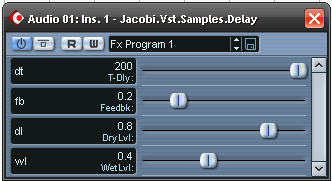

# Custom Plugin Editor

A lot of Hosts (if not all of them?) will auto-generate a UI for a Plugin that exposes Parameters. This UI can be used by the end user to manipulate the Plugin. The following image shows an example of the Delay sample in Cubase 2 SX.

  
**Host Generated Plugin Editor UI: The Delay sample in Cubase 2 SX.**
 
When a Plugin wishes to implement its own UI or does not expose any Parameters it can implement the IVstPluginEditor interface. This interface exposes methods that are called by the Host to indicate when the Editor should be opened or closed (among others).
&nbsp;<table><tr><th> Note</th></tr><tr><td>
It is important to note that the life time of the Editor UI (control) is **NOT** coupled to the lifetime of the object that implements the `IVstPluginEditor` interface.</td></tr></table>

## WinForms Support

The Framework provides a class that can be used to host a WinForms (User) Control as the Editor (child) window. The WinFormsControlWrapper class is a generic class that takes the type of the WinForms control to provide easy integration. Note that the `Open` and `Close` methods of the wrapper class map seamlesly to the methods on the `IVstPluginEditor` interface as well as the `Bounds` property.

Refer to the MidiNoteMapper sample for more information.

## Wpf Support

The Framework does <u>not</u> provide any support for Wpf. That is because we would like to keep the .NET version dependency as low as possible (.NET Framework 2.0). Wpf support would require a minimum dependency on .NET Frameworl 3.0.

But the CorePlugin does contain a sample of how one might implement a Wpf wrapper class. The WpfControlWrapper could be used to attach a Wpf Control to the unmanaged Windows Handle that is passed into the `Open` method of the `IVstPluginEditor` interface.

## See Also

#### Reference
IVstPluginEditor WinFormsControlWrapper WpfControlWrapper 

#### Other Resources
<a href="bf34ecc4-5cd1-4770-86fe-2cda55f05823">Jacobi.Vst.Framework</a> 