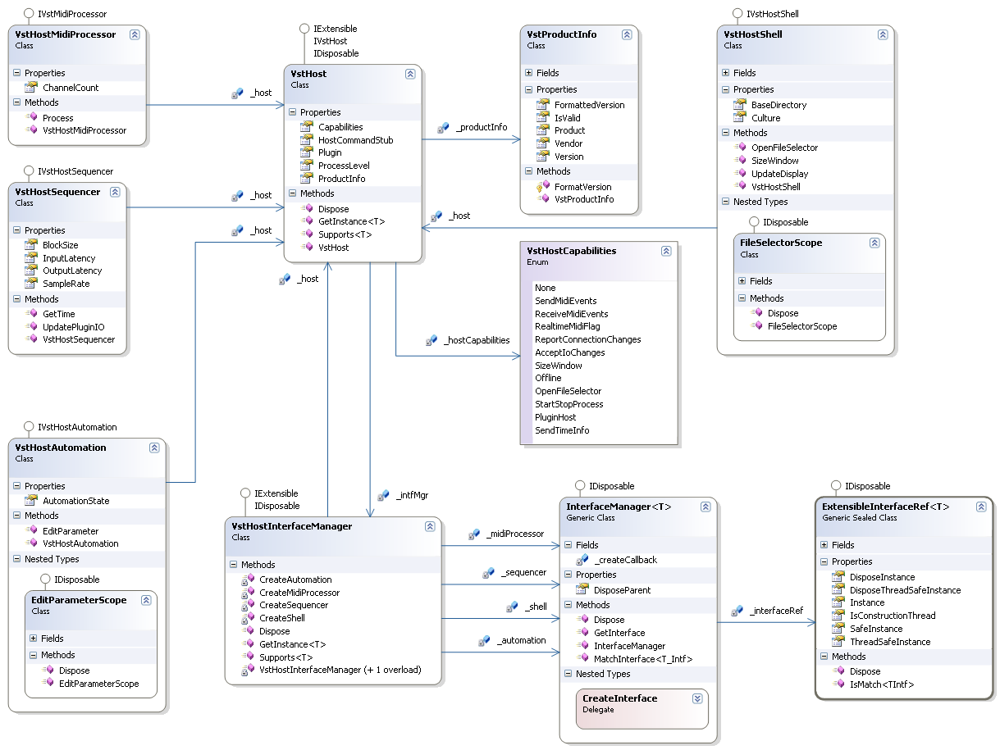

# Host Command Proxy

The Host Command Proxy is used in the same way as the <a href="30e478e7-4eba-4eab-8a32-f9d9a2c4d2b3">Plugin Command Proxy</a> but in the oposite direction. The Host Command Proxy is an object (or multiple as we will see) that lives inside the mananged Plugin and forwards managed calls from the Plugin to the Host. At "the other end" the <a href="1386a1db-aa7f-437f-94d2-a6755e375ea6">Host Command Stub</a> receives the call (inside the <a href="e5d53d11-e4bb-43b9-abe9-04b0507465dc">Jacobi.Vst.Interop</a> assembly), converts the data types and calls the Host callback function through a function pointer that was provide by the host during the Plugin loading sequence.

## Inside the Framework

Although it does not bear the name of Host Command Proxy, there is one implemented in the <a href="bf34ecc4-5cd1-4770-86fe-2cda55f05823">Jacobi.Vst.Framework</a> assembly, inside the Host namespace. This namespace only contains classes that are internal (not public). The class that implements the IVstHost interface is the root object of the Host Command Proxy. The other functionality of the Host is provided by other `IVstHostXxxx` interfaces that only will be available to the Plugin if the Host supports the functionality they represent. There are also some methods that return a boolean as an indication wether they are supported or not.
&nbsp;<table><tr><th> Note</th></tr><tr><td>
The Host Command Proxy is not an object you have to write yourself unless you write a Core Level Plugin, and even then you have the choice of not writing one, but instead directly use the `IVstHostCommandStub` interface that is passed to your Plugin.</td></tr></table>

## Class Diagram

The following class diagram details the Host Command Proxy as it is implemented in the <a href="bf34ecc4-5cd1-4770-86fe-2cda55f05823">Jacobi.Vst.Framework</a> assembly.

  
**Class Diagram: The Host Command Proxy**
 
The VstHost class is the Host root object, same way we have a <a href="62feac6e-0c75-4ef8-8703-fb970f81280b">Plugin Root Class</a>. The `VstHost` class exposes the Host capabilities (as an enum) and the Host product information ( VstProductInfo). It implements the IExtensible interface to allow exposing other Host interfaces to the Plugin. These interfaces are only available when the Host actually supports that specific feature. So requesting a reference to the `IVstMidiProcessor` interface while running inside a Host that does not support receiving Midi from a Plugin, will return null.

The actual work of managing all the interface references for the Host root object is performed by the VstHostInterfaceManager class. This class uses the InterfaceManager class for each interface reference that in turn uses the ExtensibleInterfaceRef class. This class maintains two interface references: one default reference that is only used when called the Thread it was constructed on, and a Thread safe interface reference that is used when called from any other Thread.

The VstHostMidiProcessor class implements the `IVstMidiProcessor` inetrface for the Host. This allows a Plugin to send Midi information to the Host, if the Host supports receiving Midi events from the Plugin.

The VstHostSequencer class implements the `IVstHostSequencer` interface that contains all the audio processing related information. This interface is always available although some methods return a boolean to indicate if they are supported by the Host.

The VstHostShell class implements the `IVstHostShell` interface that allows the Plugin to interact with the Host's shell. This interface is also always available although some methods return a boolean to indicate if they are supported by the Host. The nested type `FileSelectorScope` implements the `IDisposable` interface that is returned from the [M:Jacobi.Vst.Framework.Host.VstHostShell.OpenFileSelector()] method and can be used by the Plugin to indicate how long the information is needed.

The VstHostAutomation class implements the `IVstHostAutomation` interface that allows a Plugin to notify the Host of Parameter changes that may be automated by the Host. It also exposes the Automation state of the Host to the Plugin. The `EditParameterScope` implements the `IDisposable` interface that is returned from the [M:Jacobi.Vst.Framework.Host.VstHostAutomation.EditParameter()] method and can be used by the Plugin to indicate that a parameter value has changed.

## See Also

#### Reference
<a href="T_Jacobi_Vst_Core_Plugin_IVstHostCommandStub">IVstHostCommandStub</a> IVstHost IVstHostAutomation IVstHostSequencer IVstHostShell VstHost VstHostMidiProcessor VstHostSequencer VstHostShell VstHostAutomation 

#### Other Resources
<a href="1386a1db-aa7f-437f-94d2-a6755e375ea6">Host Command Stub</a> <a href="bf34ecc4-5cd1-4770-86fe-2cda55f05823">Jacobi.Vst.Framework</a> 