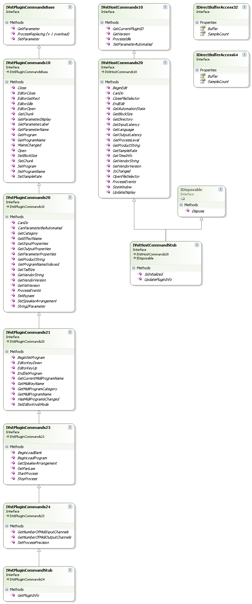
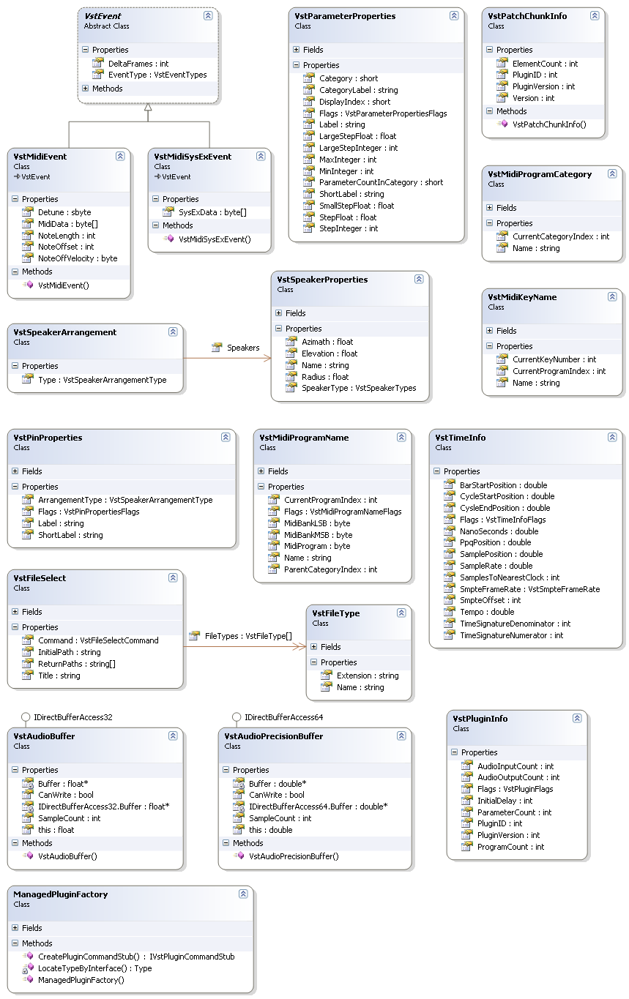
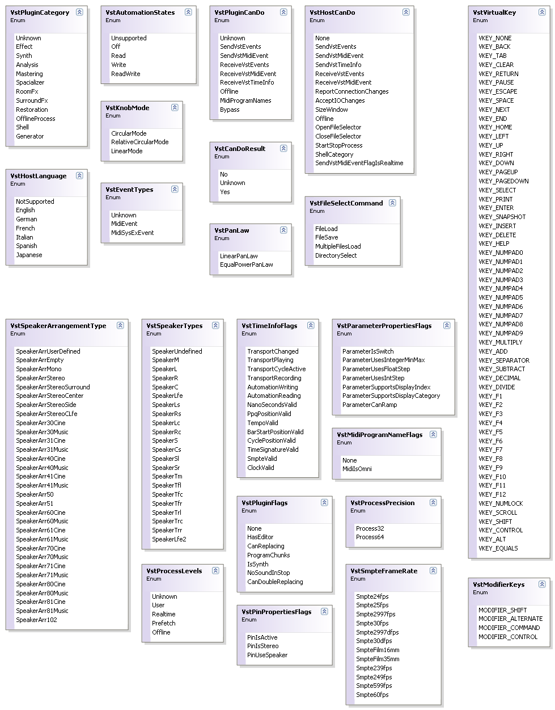

# Jacobi.Vst.Core

The <a href="4f3d4350-e61e-4909-a294-c281511a336a">Jacobi.Vst.Core</a> assembly contains the common managed types that are shared between the managed Plugin and the <a href="e5d53d11-e4bb-43b9-abe9-04b0507465dc">Jacobi.Vst.Interop</a> assembly. Most (if not all) of these types are 1:1 representations of the unmanaged native <a href="c5859574-6e7a-4f9c-b2f8-ff4428f2aa14">Vst 2.4</a> C++ types. The assembly also declares the to interface chains for the Host Commands and the Plugin Commands.

## The Core Interfaces

The interfaces defined in the assembly are (mainly) the interfaces that declare all the method calls that a Host can send to a Plugin or a Plugin can sent to a host. There are also two interfaces for direct buffer access to the audio samples that are passed during <a href="1977452f-9b2d-4d4f-a93c-768ab2ede63e">Audio Processing</a> into the Plugin.

  
**Class Diagram: The Core Interfaces**
 
The <a href="T_Jacobi_Vst_Core_IVstPluginCommandsBase">IVstPluginCommandsBase</a> interface declares the methods that are called "directly" by the Host through the function pointers passed in the `AEffect` structure. The derived interfaces <a href="T_Jacobi_Vst_Core_IVstPluginCommands10">IVstPluginCommands10</a>, <a href="T_Jacobi_Vst_Core_IVstPluginCommands20">IVstPluginCommands20</a>, <a href="T_Jacobi_Vst_Core_IVstPluginCommands21">IVstPluginCommands21</a>, <a href="T_Jacobi_Vst_Core_IVstPluginCommands23">IVstPluginCommands23</a> and <a href="T_Jacobi_Vst_Core_IVstPluginCommands24">IVstPluginCommands24</a> each declare the methods that are dispatched using the opcodes (see <a href="c5859574-6e7a-4f9c-b2f8-ff4428f2aa14">Vst 2.4</a>) for each version of the VST Standard. The last interface in the chain is the <a href="T_Jacobi_Vst_Core_Plugin_IVstPluginCommandStub">IVstPluginCommandStub</a> interface that implements the <a href="http://www.codeplex.com/vstnet">VST.NET</a> specific methods that are needed for _VST.NET_ to operate.

For the calls that can be made to the Host, the <a href="T_Jacobi_Vst_Core_IVstHostCommands10">IVstHostCommands10</a> and <a href="T_Jacobi_Vst_Core_IVstHostCommands20">IVstHostCommands20</a> interfaces declare the methods for each _VST_ version. There is no base interface here because all communication with the Host is done with opcodes (see <a href="c5859574-6e7a-4f9c-b2f8-ff4428f2aa14">Vst 2.4</a>). The <a href="T_Jacobi_Vst_Core_Plugin_IVstHostCommandStub">IVstHostCommandStub</a> interface agaun declares the method needed for _VST.NET_ to work.

The <a href="T_Jacobi_Vst_Core_IDirectBufferAccess32">IDirectBufferAccess32</a> and <a href="T_Jacobi_Vst_Core_IDirectBufferAccess64">IDirectBufferAccess64</a> interfaces are implemented on the <a href="T_Jacobi_Vst_Core_VstAudioBuffer">VstAudioBuffer</a> and the <a href="T_Jacobi_Vst_Core_VstAudioPrecisionBuffer">VstAudioPrecisionBuffer</a> classes, to allow unmanaged direct access to the underlying unmanged values.

## The Core Types

The Classes defined in the assembly are all modeled in almost the same way as the unmanaged counterparts (see <a href="c5859574-6e7a-4f9c-b2f8-ff4428f2aa14">Vst 2.4</a>). There are two exceptions and that is the <a href="T_Jacobi_Vst_Core_Plugin_ManagedPluginFactory">ManagedPluginFactory</a> class, which is used during the Plugin loading sequence in the <a href="e5d53d11-e4bb-43b9-abe9-04b0507465dc">Jacobi.Vst.Interop</a> assembly and the <a href="T_Jacobi_Vst_Core_Plugin_VstPluginInfo">VstPluginInfo</a> class, which is used to communicate the initial Plugin properties to the Host (these values are copied to the native `AEffect` structure). The following class diagram shows the classes of the assembly.

  
**Class Diagram: The Core Types**
 
The <a href="T_Jacobi_Vst_Core_VstEvent">VstEvent</a> class and the derived <a href="T_Jacobi_Vst_Core_VstMidiEvent">VstMidiEvent</a> and <a href="T_Jacobi_Vst_Core_VstMidiSysExEvent">VstMidiSysExEvent</a> classes are used when passing _MIDI_ information either from Host to Plugin or visa versa. In other versions of _VST_ there were some other types of events but these are all deprecated in version 2.4. The Parameters of a Plugin are communicated directly using methods in the <a href="T_Jacobi_Vst_Core_Plugin_IVstPluginCommandStub">IVstPluginCommandStub</a> interface. There is one method that passes a structure to obtain extra (meta) information on a parameter. This structure is represented by the <a href="T_Jacobi_Vst_Core_VstParameterProperties">VstParameterProperties</a> class. The <a href="T_Jacobi_Vst_Core_VstPatchChunkInfo">VstPatchChunkInfo</a> class is used to communicate meta information on a chunk of persisted Plugin information. The <a href="T_Jacobi_Vst_Core_VstMidiProgramCategory">VstMidiProgramCategory</a> class is used to communicate Midi Program Categories a Plugin could implement. The <a href="T_Jacobi_Vst_Core_VstMidiKeyName">VstMidiKeyName</a> class is used to communicate the names of Midi Note numbers. The <a href="T_Jacobi_Vst_Core_VstSpeakerArrangement">VstSpeakerArrangement</a> and the <a href="T_Jacobi_Vst_Core_VstSpeakerProperties">VstSpeakerProperties</a> classes as well as the <a href="T_Jacobi_Vst_Core_VstPinProperties">VstPinProperties</a> class are used to communicate the number of audio channels a Plugin might support. The <a href="T_Jacobi_Vst_Core_VstMidiProgramName">VstMidiProgramName</a> class is used to communicate Midi Patch names a Plugin might support. The <a href="T_Jacobi_Vst_Core_VstTimeInfo">VstTimeInfo</a> is used to communicate time information. The <a href="T_Jacobi_Vst_Core_VstFileSelect">VstFileSelect</a> and <a href="T_Jacobi_Vst_Core_VstFileType">VstFileType</a> classes are used to open a File Selector dialog in the Host and communicate the user's choice back to the Plugin.

## The Core Enumerations

The enums declared in the assembly, again, resemble their unamanged counterparts very closely. The following class diagram shows these enums.

  
**Class Diagram: The Core Enumerations**
 

## See Also

#### Other Resources
<a href="c5859574-6e7a-4f9c-b2f8-ff4428f2aa14">Vst 2.4</a> <a href="e5d53d11-e4bb-43b9-abe9-04b0507465dc">Jacobi.Vst.Interop</a> 