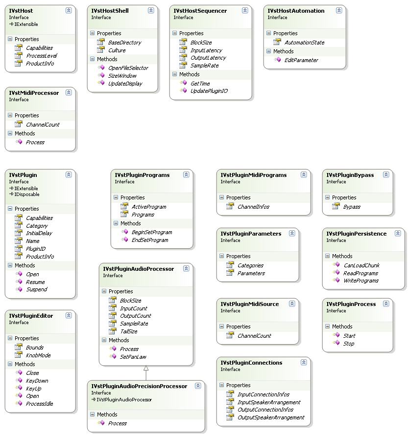
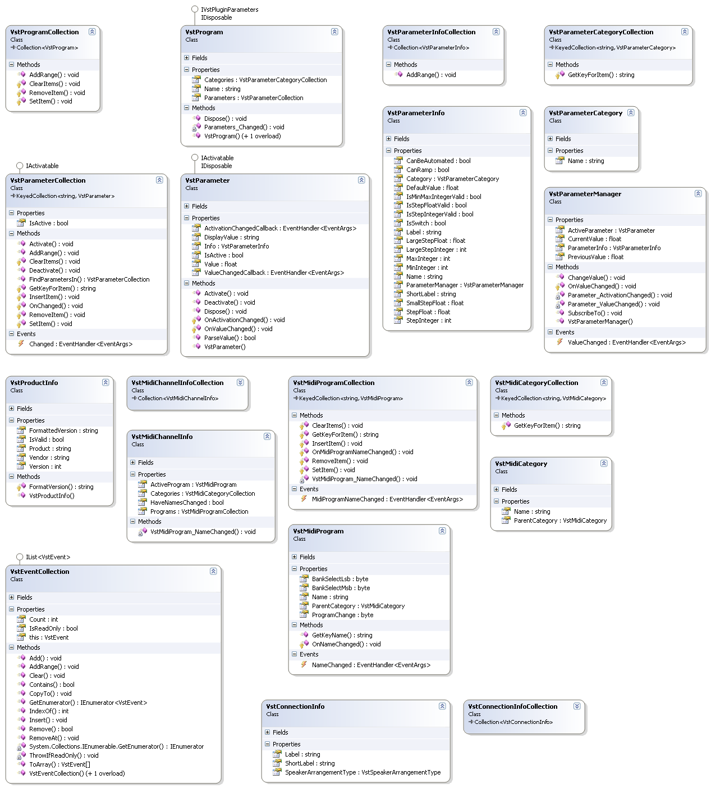

# Jacobi.Vst.Framework

The <a href="bf34ecc4-5cd1-4770-86fe-2cda55f05823">Jacobi.Vst.Framework</a> assembly is an optional assembly that provides the Plugin developer with a structured way to implement a VST Plugin. The assembly implements a <a href="bf904c4c-fdf7-4e94-8590-13d0b3d9baf6">Plugin Command Stub</a> and some base classes that make implementing a Plugin a breeze. The developer can focus on the functional code and spents far less time on 'plumbing'. Each feature of a VST Plugin is declared in an (optional) code interface that can be implemented by the developer, thus clarifying the requirements for supporting that feature.

The <a href="bf34ecc4-5cd1-4770-86fe-2cda55f05823">Jacobi.Vst.Framework</a> assembly also provides some abstraction over the 'bare' VST standard, especially for Plugin Programs and Parameters. These 'services' will help you to accelerate your Plugin development even further.

The following sections discuss the interfaces and class of the <a href="bf34ecc4-5cd1-4770-86fe-2cda55f05823">Jacobi.Vst.Framework</a> assembly in more detail.

## Framework Interfaces

The following class diagram shows the interfaces that are defined by the <a href="bf34ecc4-5cd1-4770-86fe-2cda55f05823">Jacobi.Vst.Framework</a> assembly. The interfaces at the top of the diagram are used to access the Host from within the Plugin and the bottom interfaces are called by the <a href="e5d53d11-e4bb-43b9-abe9-04b0507465dc">Jacobi.Vst.Interop</a> assemlby when the Host calls into the Plugin.

  
**Class Diagram: The Framework Interfaces**
 
The IVstHost interface represents the Host root interface of the <a href="a6802bfe-1ae8-444e-abd5-dbe1a348f193">Host Command Proxy</a>. 
The other interfaces IVstHostShellIVstHostSequencer and IVstHostAutomation can be retrieved using the GetInstance() method of the IExtensible interface from which `IVstHost` derives.

The IVstMidiProcessor interface is used in the Host as well as the Plugin implementation. When the Host supports accepting Midi events from a Plugin it is available through the `IVstHost` root interface. When the Plugin want to receive Midi Events from the Host it can implement the interface and make it available through the IVstPlugin root interface, that also derives from `IExtensible`.

Note that the `IVstPlugin` inherits from the <a href="https://docs.microsoft.com/dotnet/api/system.idisposable" target="_blank">IDisposable</a> interface. `Dispose` is called at the very end of the life cycle of the Plugin at which time the Plugin can cleanup all resources it used.

The IVstPluginPrograms interface can be implemented by the Plugin if it supports <a href="da9d3d7d-c5f5-4d05-99a2-70b020f2cbfb">Plugin Programs</a> or presets. The IVstPluginParameters interface is closely linked to the `IVstPluginPrograms` interface but can also be implemented seperately (if Programs are not supported).

The IVstPluginEditor interface represents the ability of having a custom Plugin editor UI.

When a Plugin implements the IVstPluginAudioProcessor and/or IVstPluginAudioPrecisionProcessor interfaces it indicates the capability of processing audio samples.

A Plugin can implement the IVstPluginMidiPrograms when it supports Midi ( `IVstMidiProcessor` ) and Midi Patches or Programs. The IVstPluginMidiSource interface is implemented when a Plugin outputs Midi events to the Host.

The IVstPluginConnections interface give a Plugin the opportunity to manage its audio channels (or connections) dynamically. There is sort of handshake between Host and Plugin to determine the actual number of audio channels.

The IVstPluginBypass interface can be implemented by the Plugin when it allows for a soft bypass or needs to be aware that it is bypassed.

The IVstPluginProcess interface notifies the Plugin when the Host starts and stops processing audio samples. This can be used to allocate and free resources for Plugin audio processing.

When a Plugin state cannot be expressed in Parameters and Programs the IVstPluginPersistence interface allows a Plugin to load and save its state as an opague blob. What structure the Plugin uses to read and write its settings is completely free.

Refer to the relative sections for more information on these interfaces.

## Framework Types

The following class diagram shows the classes that come with the <a href="bf34ecc4-5cd1-4770-86fe-2cda55f05823">Jacobi.Vst.Framework</a> assembly. Most class are paired in an item class and a collection class.

  
**Class Diagram: The Framework Types**
 
Refer to the relative sections for more information on the rest of the classes.

## See Also

#### Reference
IVstHost IVstHostShell IVstHostSequencer IVstHostAutomation IVstMidiProcessor IVstPlugin IVstPluginParameters IVstPluginPrograms IVstPluginEditor IVstPluginAudioProcessor IVstPluginAudioPrecisionProcessor IVstPlugin IVstPluginMidiPrograms IVstPluginBypass IVstPluginPersistence IVstPluginMidiSource IVstPluginProcess IVstPluginConnections VstProgram VstProgramCollection VstParameter VstParameterCollection VstParameterInfo VstParameterInfoCollection VstParameterManager VstParameterCategory VstParameterCategoryCollection VstProductInfo VstMidiChannelInfo VstMidiChannelInfoCollection VstMidiProgram VstMidiProgramCollection VstMidiCategory VstMidiCategoryCollection VstConnectionInfo VstConnectionInfoCollection VstEventCollection 

#### Other Resources
<a href="bf904c4c-fdf7-4e94-8590-13d0b3d9baf6">Plugin Command Stub</a> <a href="a6802bfe-1ae8-444e-abd5-dbe1a348f193">Host Command Proxy</a> <a href="62feac6e-0c75-4ef8-8703-fb970f81280b">Plugin Root Class</a> <a href="0aca5a96-16d9-4f8e-a830-202d8bad418a">Plugin Interface Manager</a> <a href="1977452f-9b2d-4d4f-a93c-768ab2ede63e">Audio Processing</a> <a href="da9d3d7d-c5f5-4d05-99a2-70b020f2cbfb">Plugin Programs</a> <a href="c3df31da-acf5-4f57-8178-c00b1bc545ba">Plugin Parameters</a> <a href="9285210d-328b-495d-826e-9a20939004d1">Plugin Persistence</a> <a href="b1420795-40cc-451e-8240-582023abe7ab">Custom Plugin Editor</a> <a href="95fdded5-2ce5-401d-aecd-ff8feceaba91">Midi Processing</a> <a href="ba4dbc74-d9b0-439a-b767-ada82c153a56">Plugin Midi Programs</a> <a href="f6dfa34b-ce35-4e73-9f79-d5056050800d">Plugin Connections</a> 