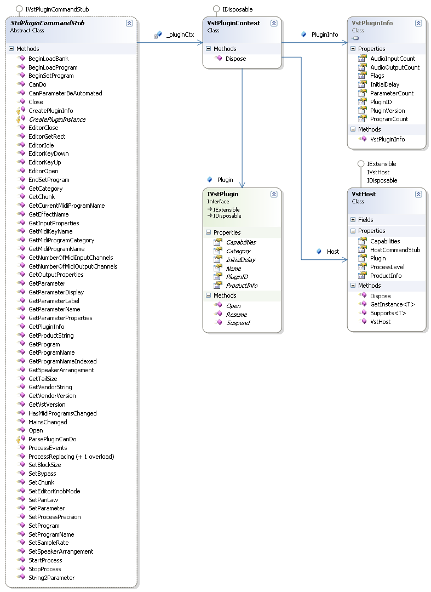

# Plugin Command Stub

The Plugin Command Stub is the managed class that implements the <a href="T_Jacobi_Vst_Core_Plugin_IVstPluginCommandStub">IVstPluginCommandStub</a> interface. That class must be public in the managed Plugin assembly in order for the <a href="4781d47a-3b7a-41a6-b632-4a6785082bfa">Managed Plugin Factory</a> to load it and pass it to the <a href="30e478e7-4eba-4eab-8a32-f9d9a2c4d2b3">Plugin Command Proxy</a>. The Plugin Command Stub receives calls on its methods from the Plugin Command Proxy and dispatches them inside the managed Plugin. If you use the <a href="bf34ecc4-5cd1-4770-86fe-2cda55f05823">Jacobi.Vst.Framework</a> assembly to help with your implementation, its very easy to implement the Plugin Command Stub. If you program at Core level, only using the <a href="4f3d4350-e61e-4909-a294-c281511a336a">Jacobi.Vst.Core</a> assembly, you have to implement all these methods (almost 60!) yourself.

## Using the Framework

When using the <a href="bf34ecc4-5cd1-4770-86fe-2cda55f05823">Jacobi.Vst.Framework</a> assembly for your managed Plugin, you can take advantage of the provided Plugin Command Stub. The StdPluginCommandStub base class dispatches all calls to the (optional) interfaces a Plugin can implement. These interfaces are all discovered through the IExtensible interface on the <a href="62feac6e-0c75-4ef8-8703-fb970f81280b">Plugin Root Class</a>.

When an interface is not supported by a Plugin implementation the stub returns a value that indicates this. If the Plugin does support the interface in question it is retrieved through the GetInstance() method and the appropriate method on that interface is called. Most of the calls on the framework interfaces are more or less the same as the methods on the `IVstPluginCommandStub` interface, there some exception however, where the framework adds an abstraction to provide a clearer mechanism for the developer. <a href="da9d3d7d-c5f5-4d05-99a2-70b020f2cbfb">Plugin Programs</a>, <a href="c3df31da-acf5-4f57-8178-c00b1bc545ba">Plugin Parameters</a> and <a href="ba4dbc74-d9b0-439a-b767-ada82c153a56">Plugin Midi Programs</a> are at a higher level of abstraction than the underlying VST types.

## Class Diagram

The following class diagram shows the classes involved in the Framework implementation of the Plugin Command Stub.

  
**Class Diagram: The Plugin Command Stub**
 
The StdPluginCommandStub implements the IVstPluginCommandStub() interface. Each method dispatches its call to on of the interfaces through the <a href="62feac6e-0c75-4ef8-8703-fb970f81280b">Plugin Root Class</a>. The VstPluginContext class maintains the context in which the Plugin is running. The <a href="T_Jacobi_Vst_Core_Plugin_VstPluginInfo">VstPluginInfo</a> that is returned to the <a href="e5d53d11-e4bb-43b9-abe9-04b0507465dc">Jacobi.Vst.Interop</a> assembly during the loading sequence and the VstHost that encapsulates the <a href="T_Jacobi_Vst_Core_Plugin_IVstHostCommandStub">IVstHostCommandStub</a> interface. The Plugin itself is created and a reference to its implementation of the IVstPlugin interface is stored in the Plugin Context.

## Core level Implementation

When using only the <a href="4f3d4350-e61e-4909-a294-c281511a336a">Jacobi.Vst.Core</a> assembly for your managed Plugin, you will have to implement all the methods of the `IVstPluginCommandStub` by hand. Although a lot of these methods are optional it is clearly more work. To help you get started use the code from the <a href="3feb73bb-72dd-4618-816f-f9f1c46d7f73">Implement the Plugin Command Stub</a> section. Also look at the **Jacobi.Vst.Samples.CorePlugin** sample application for it also implements a custom Plugin Command Stub.

## See Also

#### Reference
<a href="T_Jacobi_Vst_Core_Plugin_IVstPluginCommandStub">IVstPluginCommandStub</a> StdPluginCommandStub 

#### Other Resources
<a href="3feb73bb-72dd-4618-816f-f9f1c46d7f73">Implement the Plugin Command Stub</a> <a href="bf34ecc4-5cd1-4770-86fe-2cda55f05823">Jacobi.Vst.Framework</a> 