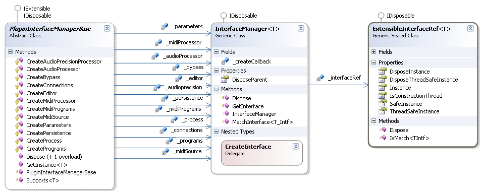

# Plugin Interface Manager

The Plugin Interface Manager is a class the devloper writes that handles the requests from the <a href="bf34ecc4-5cd1-4770-86fe-2cda55f05823">Jacobi.Vst.Framework</a> for optional interface implementations.


The <a href="http://www.codeplex.com/vstnet">VST.NET</a> Plugin Framework delcares an interface for each VST feature. When the Plugin is started it communicates some of these features to the Host (so it knows what to expect) through bit-flags. But other calls a Host can make to a Plugin can cause the <a href="bf34ecc4-5cd1-4770-86fe-2cda55f05823">Jacobi.Vst.Framework</a> to query the managed Plugin for additional interface implementations. These enquiries are performed on the IExtensible implementation on the <a href="62feac6e-0c75-4ef8-8703-fb970f81280b">Plugin Root Class</a>.


A Plugin can pick and choose the VST features it likes (or needs) to support and communicate those choices through returning implementation references of the specific interfaces when asked for them by the Framework.


## The Plugin Interface Manager Base Class

As with a lot of other VST.NET code, you have several options to implement the IExtensible interface of the <a href="62feac6e-0c75-4ef8-8703-fb970f81280b">Plugin Root Class</a>.
&nbsp;<ul><li>Use a custom implementation.</li><li>Derive a class from `PluginInterfaceManagerBase` and route the requests from the `Plugin Root Class` to this instance.</li><li>Derive your `Plugin Root Class` from the VstPluginWithInterfaceManagerBase base class. This class itself derives from `PluginInterfaceManagerBase`.</li></ul>&nbsp;
The PluginInterfaceManagerBase class provides a basis for implementing a mechanism to manage the creation and destruction of all the interface implementation instances. Two out of the three options use this class in one way or another.


The `PluginInterfaceManagerBase` also implements the IExtensible interface, making it easy to connect the Interface Manager to the <a href="62feac6e-0c75-4ef8-8703-fb970f81280b">Plugin Root Class</a>.


The `PluginInterfaceManagerBase` implements a virtual method for each (type of) interface in the Framework. When an interface is requested its cached references is checked (discussed later in more detail) and if it is null, the virtual method for that type of interface is called. The derived class has the virtual methods overridden of all the interface types the Plugin supports. The default implementation causes a null reference to be returned.


The virtual methods are all prefixed with _Create_ followed by the name of the interface but without the _IVstPlugin_ prefix. All virtual methods are typed to their related interfaces. The following code example shows an abstraction of their method signatures (where T is the interface Type): 
**C#**<br />
``` C#
protected virtual T CreateXxxxx(T instance);
```


Because a Host usually uses several threads to call into a Plugin, the chances are real that the thread the interface implementation class instance was created on will not always be used for future calls. The Interface Manager assumes you have a synchronized wrapper class for each interface implementation or that the implementation itself is thread safe. That is why the virtual `CreateXxxxx` methods can be called once or twice (but never more).
&nbsp;<ol><li>The first time the method is called the `instance` parameter is null and you are requested to return your default implementation.</li><li>The second time the method is called the `instance` parameter contains the default instance you returned when called for the first time and you are requested to return your thread-safe interface implementation.</li></ol>&nbsp;
Now if the default interface implementation is thread-safe to begin with, you can simply return the `instance` parameter on the second time the method is called. If not, you can wrap the default interface implementation in a synchronized wrapper implementation. Using a synchronized wrapper will not add locking overhead when the calling thread is the original thread that created the interface implementation instance.


## Class Diagram

The following class diagram shows the internal structure of the `PluginInterfaceManagerBase` class.

<br /><br />
**Class Diagram: The Plugin Interface Manager**
<br />
For each interface reference the `PluginInterfaceManagerBase` manages a `InterfaceManager{T}` class is created. This internal class implements the logic for calling the virtual `CreateXxxxx` method through a delegate. It stores the interface implementation references (default and thread-safe) using an instance of the `ExtensibleInterfaceRef` class. This class is public and you can use it to implement your own Interface Manager if you decide to do so. The `ExtensibleInterfaceRef` class also stores the thread ID of the thread that constructs the default (first) interface implementation reference. The `SafeInstance` property either returns the default instance, when the call was made from the same thread that constructed the interface implementation reference, or the thread-safe instance when the call was made from another thread. The `Instance` and `ThreadSafeInstance` properties access the respective types of instances. Note that setting these properties requires the property value to be null. This is to catch accidental overwrites of already set instances.


## See Also


#### Reference
IExtensible<br />ExtensibleInterfaceRef<br />PluginInterfaceManagerBase<br />VstPluginWithInterfaceManagerBase<br />

#### Other Resources
<a href="62feac6e-0c75-4ef8-8703-fb970f81280b">Plugin Root Class</a><br /><a href="bf34ecc4-5cd1-4770-86fe-2cda55f05823">Jacobi.Vst.Framework</a><br />