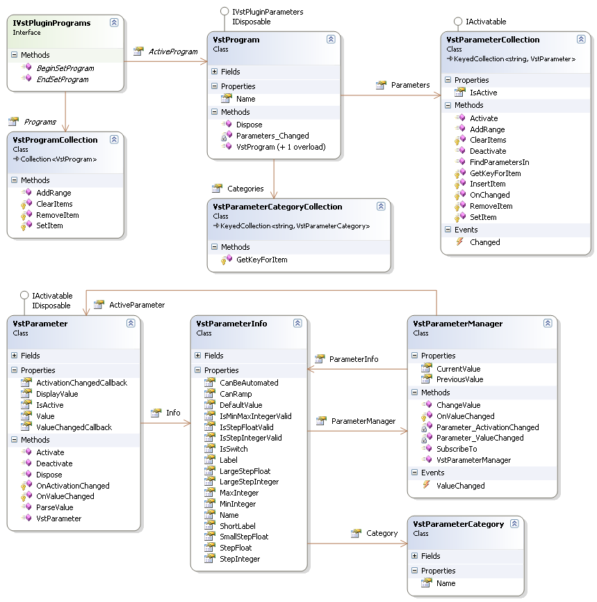

# Plugin Programs

A Plugin Program is a saved set of values for all Plugin Parameters. When a Plugin supports Programs it typically reserves a fixed number at start-up. A user can change Programs on a Plugin and thereby changing the values for all Parameters quickly. Some Plugin also support Presets. A Preset is a read-only Program. Its settings for all Plugin Parameters can not be changed by the user. Think of them as Factory or Demo Presets.


## Framework Program Support

A Plugin that supports the IVstPluginPrograms interface has Programs. The interface exposes a collection of VstProgram instances. Each instance represents one Program. The `VstProgram` class also implements the IVstPluginParameters interface. So each Program has his own set of Parameters, with their unique values. But all Programs have the same number of Parameters and the `VstParameter.Info` property identifies each Parameter that is shared across Programs. Refer to this <a href="http://obiwanjacobi.blogspot.com/2008/05/vstnet-programs-and-parameters.html">blog post</a> for more information.


The VstParameterManager class manages the current value of a Parameter for multiple Programs. It is notified when Programs (and their Parameters) are activated or deactivated and updates the current Parameter value accoordingly. It also stores the previous parameter value to make it easy for any form of Parameter value smoothing to be implemented. When a Plugin does not use Programs, the `VstParameterManager` is not strictly necessary and one can interface directly with `VstParameter` to retrieve its value.


The Framework also provides a base class you can derive from to eas implementing Programs in your Plugin. The VstPluginProgramsBase abstract base class implements all members of the interface. The derived class only has to implement a method that creates the `VstProgramCollection` filled with a `VstProgram` instance for each Program the Plugin provides.


## Class Diagram

The following class diagram displays the classes involved in Plugin Parameters (at the bottom) and Programs.

<br /><br />
**Class Diagram: The Plugin Program and Parameter classes**
<br />
The VstParameterInfo class contains the meta data for a Parameter. There is only one instance of the `VstParameterInfo` class for each Parameter. The VstParameter contains the value for a Parameter and it is linked to the meta data of the Parameter through the `Info` property. Each VstProgram contains an instance of the `VstParameter` class for each `VstParameterInfo`. Each `VstProgram` contains the same Parameters (identified by `VstParameterInfo` ) but has unique values (stored by `VstParameter` ). One VstParameterManager instance associated with the `VstParameterInfo` manages the current (active) value of a `VstParameter`. When a new `VstProgram` is activated all its `VstParameter`s are also activated and each Parameter's `VstParameterManager` receives a notification to fetch a new value from the `VstParameter`.


Typically each sub-component of a Plugin (oscilators, envelopes, filters, etc.) publishes its Parameters to an internal Program factory by providing `VstParameterInfo` instances with a `VstParameterManager` attached the sub-component uses to retrieve the actual Parameter value. These sub-components can be named using VstParameterCategory instances attached to the `VstParameterInfo` objects. Hosts can than group related Parameters together in the UI.


A VstProgram instance represents one Plugin Program. All Programs for a Plugin are stored in a VstProgramCollection instance implemented by the IVstPluginPrograms interface. When the Hosts changes the Program for a plugin (or the user through a generated UI), the Framework simply assigns the new Program to the `ActiveProgram` property. Here is a typical implementation of the `ActiveProgram` property. 
**C#**<br />
``` C#
private VstProgram _activeProgram;
/// <summary>
/// Gets or sets the current or active program.
/// </summary>
public VstProgram ActiveProgram
{
    get
    {
        if (_activeProgram == null && Programs.Count > 0)
        {
            ActiveProgram = Programs[0];
        }

        return _activeProgram;
    }
    set
    {
        if (_activeProgram != null)
        {
            _activeProgram.Parameters.Deactivate();
        }

        _activeProgram = value;

        if (_activeProgram != null)
        {
            _activeProgram.Parameters.Activate();
        }
    }
}
```
&nbsp;<table><tr><th> Note</th></tr><tr><td>
This code is also implemented in the `VstPluginProgramsBase` class.</td></tr></table>

## See Also


#### Reference
IVstPluginPrograms<br />VstProgram<br />VstParameter<br />VstParameterManager<br />VstPluginProgramsBase<br />

#### Other Resources
<a href="c3df31da-acf5-4f57-8178-c00b1bc545ba">Plugin Parameters</a><br /><a href="bf34ecc4-5cd1-4770-86fe-2cda55f05823">Jacobi.Vst.Framework</a><br /><a href="http://obiwanjacobi.blogspot.com/2008/05/vstnet-programs-and-parameters.html">VST.NET Programs and Parameters</a><br />