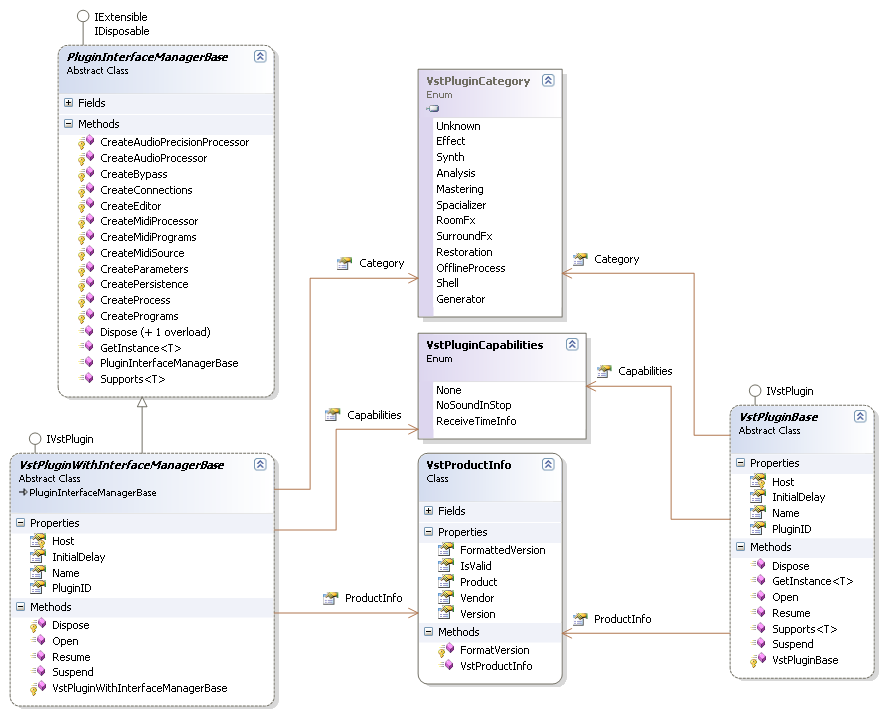

# Plugin Root Class

The Plugin Root Class (or Object) is the basis of a Plugin. It is the point from were all other actions are started. The lifetime of the root class represents the lifetime of the Plugin. The Plugin Root Class must implement the IVstPlugin interface.

## IVstPlugin interface

The IVstPlugin interface forms the basic entry point into a Plugin. It has methods open and close the Plugin ( [M:Jacobi.Vst.Framework.IVstPlugin.Open()] and [M:Jacobi.Vst.Framework.IVstPlugin.Dispose()]) and to [M:Jacobi.Vst.Framework.IVstPlugin.Suspend()] and [M:Jacobi.Vst.Framework.IVstPlugin.Resume()] the Plugin processing. Its properties communicate static Plugin information to the Framework and ultimately to the Host.

#### IExtensible interface

The IExtensible interface receives interface implementation requests from the Framework. This interface is only mandatory on the Plugin root class but can also be used in other places, if that is convenient for you. The PluginInterfaceManagerBase base class can be used to implement the `IExtensible` interface after you derive from it.

Refer to <a href="2d6d5838-0551-4404-b5c8-698de8d41aa7">Implement the Plugin Root Class</a> for more information.

#### IDisposable interface

The standard <a href="https://docs.microsoft.com/dotnet/api/system.idisposable" target="_blank">IDisposable</a> interface is used to close the Plugin when the host unloads it. The `Dispose` method is the last method called on the Plugin. Make sure you release all (unmanaged) resources and clean up properly.

## Class Diagram

The following class diagram shows the available base classes that implement the `IVstPlugin` interface for you.

  
**Class Diagram: The Plugin Root Class**
 
The PluginInterfaceManagerBase class implements a basis for managing the references to the implemented Framework Plugin interfaces. This class can also be used separately. The VstPluginWithInterfaceManagerBase base class provides you with a full implementation of the `IVstPlugin` interface. Just derive from this class and pass all your Plugin specific data in the constructor.

On the other side of the diagram is the VstPluginBase base class. This is a simplified implementation of the `IVstPlugin` interface. This implementation covers all members of the `IVstPlugin` interface but implements the `IExtensible` interface not using the PluginInterfaceManagerBase but the code outlined in <a href="2d6d5838-0551-4404-b5c8-698de8d41aa7">Implement the Plugin Root Class</a>.

Finally a word about [Jacobi.Vst.Core.VstPluginCapabilities]

 enumeration. The options in the (flags) enumeration indicate behavioral aspects of the Plugin that are not (can not) be expressed in meaningful interfaces.

## See Also

#### Reference
[Jacobi.Vst.Framework.IVstPlugin] [Jacobi.Vst.Framework.IExtensible] [Jacobi.Vst.Framework.Plugin.PluginInterfaceManagerBase] [Jacobi.Vst.Framework.Plugin.VstPluginBase] [Jacobi.Vst.Framework.Plugin.VstPluginWithInterfaceManagerBase] 

#### Other Resources
<a href="2d6d5838-0551-4404-b5c8-698de8d41aa7">Implement the Plugin Root Class</a> <a href="bf34ecc4-5cd1-4770-86fe-2cda55f05823">Jacobi.Vst.Framework</a> 