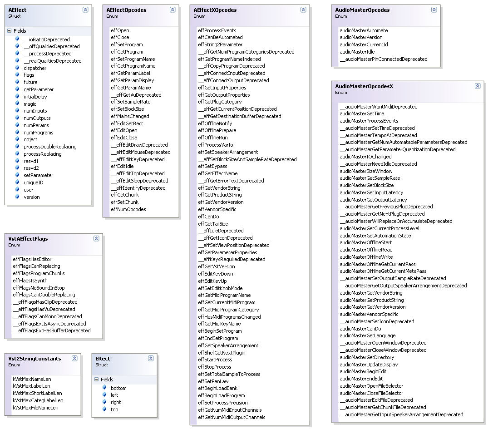

# Vst Main Types

Required introduction

## VST Main types

The following class diagram shows the main types used in the VST standard.

  
**Class Diagram: The main VST types**
 
The `AEffect` structure is returned from the `VSTPluginMain` exported function and contains the VST Plugin basic information as well as the function pointers the Host uses to call back into the Plugin. The `AEffectFlags` contains some basic options for a Plugin that are passed along with the `AEffect` structure. The `AEffectOpcodes` and the `AEffectXOpcodes` are used in `dispatcher` callback function to indicate what type of operation is requested from the Plugin. The `AudioMasterOpcodes` and `AudioMasterOpcodesX` are sent to the Host callback function passed to the plugin in a `VSTPluginMain` function parameter. These opcodes tell the Host what type of operation is requested by the plugin. The `Vst2StringContants` declares some maximum string length constants and the `ERect` is a structure used to pass around a rectangle for the bounds of an optional custom editor.
&nbsp;<table><tr><th> Note</th></tr><tr><td>
The double underscores '__' preceding some member names as well as these names ending in Deprecated, is an indication of deprecated members for VST version 2.4. These members were used in an earlier version of the VST standard but are no longer used in VST 2.4.</td></tr></table>&nbsp;
