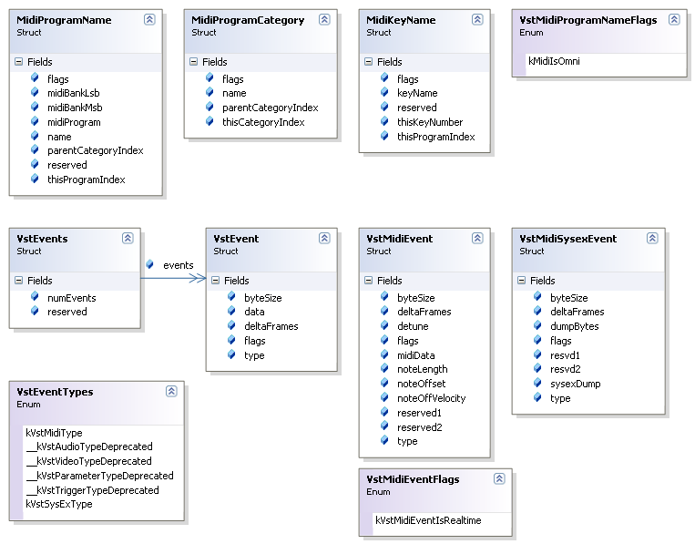

# Vst Midi Types

Required introduction

## VST Plugin Midi types  
**Class Diagram: The Plugin Midi VST types**
 
&nbsp;<table><tr><th> Note</th></tr><tr><td>
The double underscores '__' preceding some member names as well as these names ending in Deprecated, is an indication of deprecated members for VST version 2.4. These members were used in an earlier version of the VST standard but are no longer used in VST 2.4.</td></tr></table>&nbsp;
