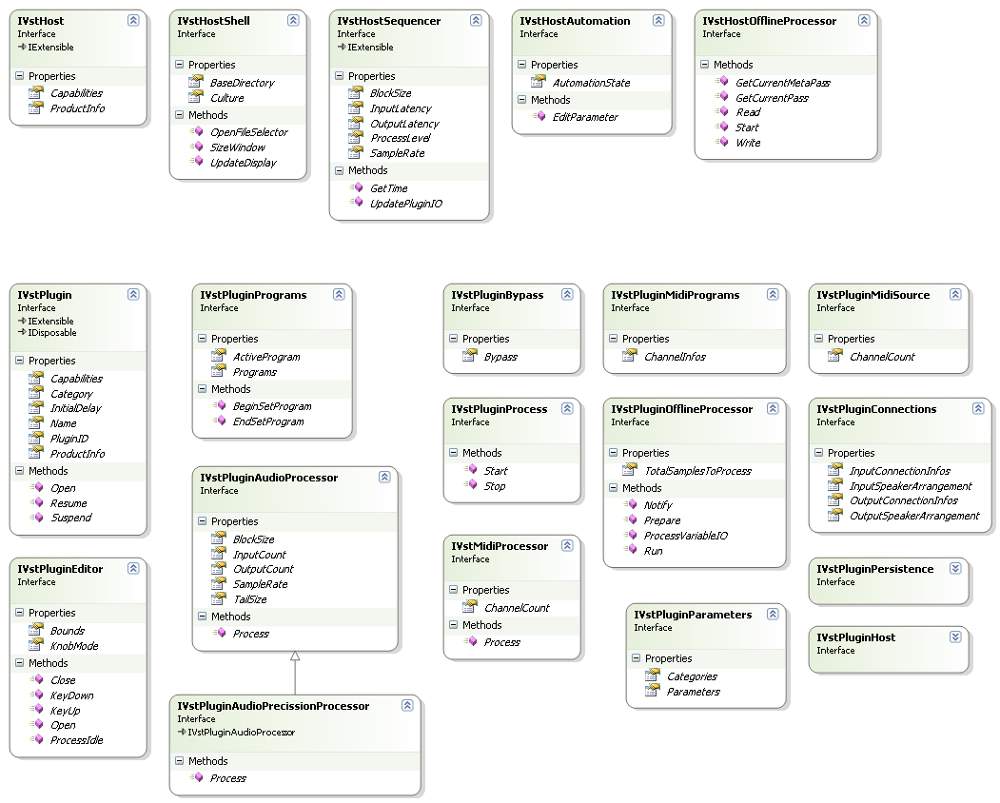
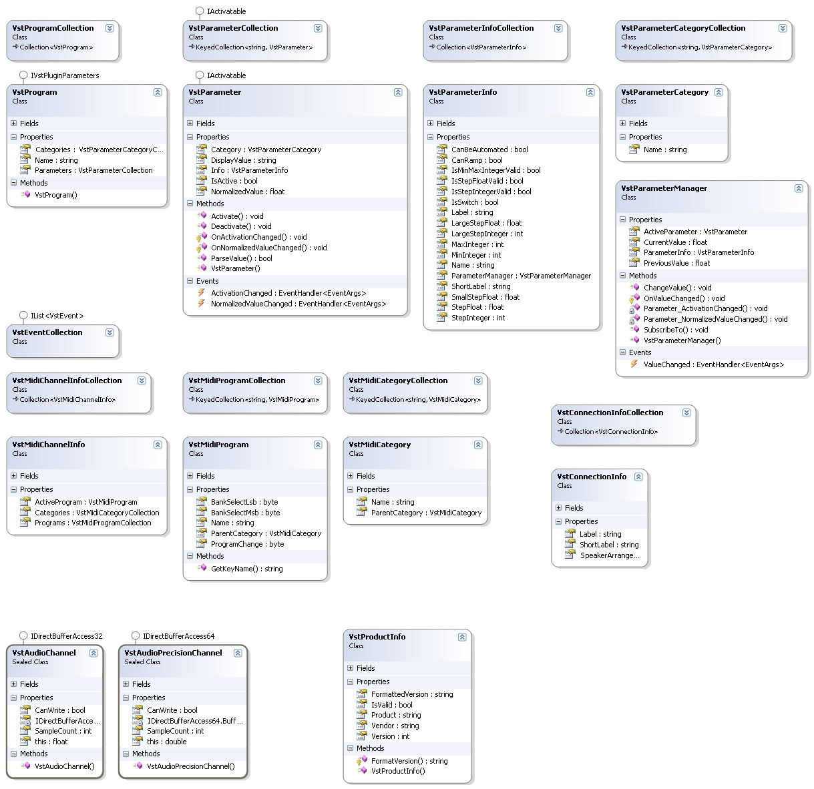

The VST.NET Framework makes it easy to create managed VST plugins. It provides you a set of plugin interfaces you can implement and a set of host interfaces you can use in your plugin to talk to your host. Capabilities of both host and plugin are communicated by supporting a specific interface. Wether or not a specific interface is available can be determined by using the IExtensible (interface) methods. The Supports method gives you a true/false indication if the interfaces is supported and the GetInstance method returns a reference to the specific interface in quesiton. This allows the plugin to dynamically determine its capabilities while still communicating that capability in a structured way (the interface).

These framework types help you in structuring common plugin information: Programs, Parameters and Midi Programs.
