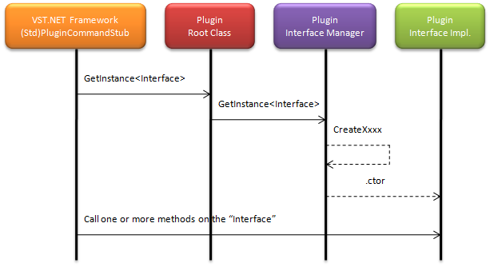
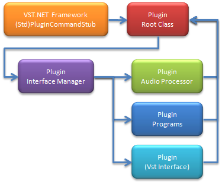

# VST.NET Plugin Structure
VST.NET allows you to write VST Plugins in managed code (VB.NET/C#). This post discusses the basic principles and structure of a typical Plugin implementation. It will attempt to show you how to write a plugin using the VST.NET Framework using code snippets.

Please read the introduction that discusses the main components of VST.NET.

## Life cycle of a Plugin
When the Host loads the renamed Interop assembly and calls the exported main method, the Interop loads the managed Plugin assembly (with the .net postfix). The assembly is scanned for a public type that implements the `IVstPluginCommandStub` and that class is instantiated. The Framework contains a default implementation for this interface that can be reused by a Plugin developer. The name of the derived stub class can be any valid class name you'd like.

```CS
public class MyPluginCommandStub : Plugin.StdPluginCommandStub, Core.Plugin.IVstPluginCommandStub
{
    protected override IVstPlugin CreatePluginInstance()
    {
        return new MyTestPlugin();
    }
}
```

The Plugin stub class is a public class and derives from the standard Framework implementation. The Plugin stub class also overrides the abstract `CreatePluginInstance` method to return a new instance of the Plugin root class (that implements IVstPlugin).

After the Plugin root class has been created it will receive a call to the Open method and from that moment on can expect VST calls on its interface implementations.

When the Plugin should be unloaded, its Dispose method is called.

The following picture displays the chain through which every Host to Plugin call travels.


Detailed information about the startup and tear down sequences can be found here.

## Plugin Capability Discovery
Part of the Plugin creation sequence is communicating the plugin capabilities to the host. The VST.NET Framework employs a paradigm where groups of related VST Plugin methods are grouped into interfaces. When a Plugin implements an interface it communicates that capability implicitly.

The Plugin root class also implements the `IExtensible` interface (besides IVstPlugin). And it is through this interface that the Plugin is queried for its implemented interfaces. This explicit querying for interfaces allows a Plugin to dynamically determine the interfaces it supports.

The following figure displays the call sequence for a Host to Plugin call and how the `StdPluginCommandStub` forwards the call to an interface implementation.



To help with implementing the IExtensible interface the Framework provides a `PluginInterfaceManagerBase` class. The plugin either derives its root class or a seperate class from this base class and overrides the virtual creation methods; one for each interface. Only the methods for the supported interfaces have to overriden and implemented.

```CS
internal class MyPlugin : Plugin.PluginInterfaceManagerBase, IVstPlugin
{
    protected override IVstPluginAudioProcessor CreateAudioProcessor(
        IVstPluginAudioProcessor instance)
    {
        if(instance == null) return new MyPluginAudioProcessor(this);

        return instance; // return thread-safe instance
    }

    // IVstPlugin members....
}
```

All `CreateXxxx` methods contain an instance parameter. This parameter is null when the interface is queried for the first time. The `CreateXxxx` method should return a reference to the interface implementation. In the example a seperate class implements the Audio Processor and receives a reference to the Plugin root object in its constructor (this). The interface manager will store the interface reference and use that to satisfy subsequent requests. When an interface request for the same interface is received on a different thread it was created on (when `CreateXxx` was called with `instance == null`), the `CreateXxxx` method is called again specifying the original interface reference. It is now up to the CreateXxxx method implementation to return a thread-safe implementation for the interface. The original interface reference is passed to the `CreateXxxx` method in order to allow the implemenation to wrap it in a thread-safe wrapper class.

You, as a Plugin developer, are free to choose where you implement the Vst interfaces. The example used a seperate class but the `IVstPluginAudioProcessor` could also have been implemented on the Plugin root class itself instead. The implementation for the `CreateAudioProcessor` method would simply return `this` as an interface reference.

You can use the `IExtensible` interface internally to query for interface implementation classes as well (not just for interfaces). With the example code in place you could do this:

```CS
// myPlugin is a reference to the Plugin root class instance.
MyPluginAudioProcessor audioProcessor = myPlugin.GetInstance<MyPluginAudioProcessor>();
```

This makes navigating around the classes that implement the Vst interfaces a lot easier.

## Vst Call Execution flow
1. The host calls one of the callback functions that were returned in the `AEffect` structure from the exported main function.
2. The Interop layer marshals that call to the implementation of the `IVstPluginCommandStub`. This interface defines a method for each possible call the Host can place tot the Plugin.
3. The `StdPluginCommandStub` Framework class queries for the specific Vst interface. Each method of the `IVstPluginCommandStub` interface is mapped to 'a method' (or construct) on a Vst Framework interface.
4. The Interface Manager attempts to map the requested (interface) type to one of the possible interfaces.
5. When the Interface Manager has matched the type it checks for a non-null reference and calls the appropriate `CreateXxxx` method if there is no reference. It returns the reference to the requested type.
6. The `StdPluginCommandStub` checks if the Plugin supports the requested Vst interface (not null) and calls 'the method' sometimes returning the return value from that method.

_The key to exposing Plugin capabilities to the Host is to implement the related Vst interface and overriding the appropriate `CreateXxxx` method on the Interface Manager. The VST.NET Framework will take care of the rest._

The following picture displays the objects that make up a typical Plugin.



The VST.NET Plugin Framework aims to provide an easy was to implement Vst Plugins with lots of flexibility how and where the Vst interfaces are implemented. Just remember that the Interface Manager is at the heart of how these interfaces implementations are discovered.

I hope this post has shed some light on the basic structure of a VST.NET plugin.

Also read about [Plugin Programs and Parameters](VST.NET%20Programs%20and%20Parameters.md).